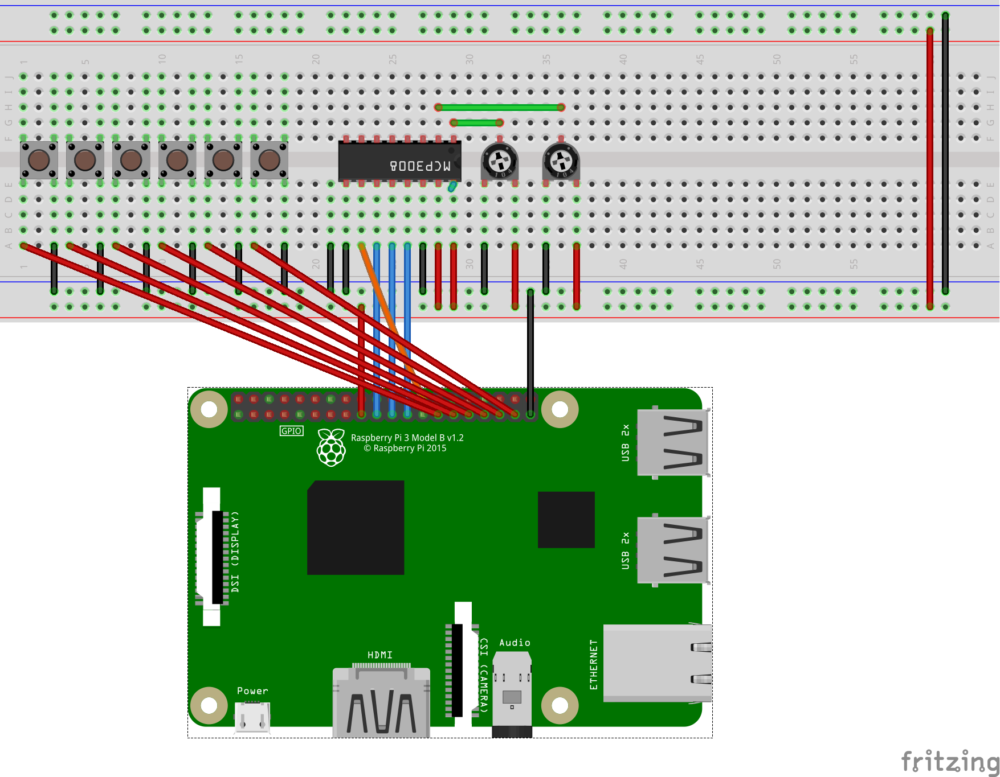

## Physical Controls

Need to use gpio extenders are something like a black hat and wire up the circuit.



--- task ---
import the gpiozero objects

```python
from gpiozero import MCP3008, Button
```
--- /task ---

--- task ---
Set up the inputs

```python
##Setup the hardware - See Fritzing wiring diagram
volume_pot = MCP3008(channel=0, select_pin=7)
position_pot = MCP3008(channel=1, select_pin=7)
play_btn =  Button(0)
stop_btn = Button(5)
pause_btn = Button(6)
next_btn = Button(13)
previous_btn = Button(19)
shuffle_btn = Button(26)
```
--- /task ---

--- task ---
Trigger functions with button presses

```python
play_btn.when_pressed = play_track
stop_btn.when_pressed = stop_track
pause_btn.when_pressed = pause_track
next_btn.when_pressed = next_track
previous_btn.when_pressed = previous_track
shuffle_btn.when_pressed = shuffle_tracks
```
--- /task ---

--- task ---
Create a function that gets the value from the volume potentiometer. As the analogue value of the pot keeps fluctuating we need to look for a significant change in the value of the pot. the `isclose` function can be used to do this.

```python
from math import isclose
```
Now continually check if the volume pot changes by more than `0.01`. If it does then the new volume can be set.

```python
def monitor_volume_pot():
    volume = volume_pot.value
    while True:
        if not isclose(volume, volume_pot.value, abs_tol=0.01):
            mixer.music.set_volume(volume_pot.value)
            volume = volume_pot.value
            show_volume_display()
```
--- /task ---

--- task ---
This function needs running in a thread

```python
volume_monitor = Thread(target=monitor_volume_pot)
volume_monitor.start()
```
--- /task ---

--- task ---
Use the same method to monitor the the position pot
```python
def monitor_position_pot():
    global seconds_played
    absolute_position = position_pot.value
    while True:
        if not isclose(absolute_position, position_pot.value, rel_tol=0.01):
            length = lengths[tracks[position]]
            mixer.music.set_pos(position_pot.value * length)
            seconds_played = position_pot.value * length
            absolute_position = position_pot.value
```
--- /task ---

--- task ---
Then run it in it's own thread

```python
position_monitor = Thread(target=monitor_position_pot)
position_monitor.start()
```
--- /task ---


--- collapse ---
---
title: Full code
---
```python
##Import the required modules
from pygame import mixer
from guizero import App, PushButton, Slider, Text
from mutagen.mp3 import MP3
from os import listdir
from random import shuffle
from sense_hat import SenseHat
from sense_hat_icons import *
from threading import Thread
from gpiozero import MCP3008, Button
from math import isclose


##Initialise the mixer and create objects
mixer.init()
app = App(title="Hallelujah Player", height=140, width = 610, layout="grid")
sense = SenseHat()


##Create some constants
PATH = "/home/pi/Music/"
RED = (255,0,0)
WHITE = (255,255,255)
GREEN = (0,255,255)
BLACK =(0,0,0)

##Get the list of tracks from the Music dir
tracks = sorted([file for file in listdir(PATH) if file.endswith(".mp3")])


##Find the length of each track and store in dictionary
lengths = {track: MP3(PATH + track).info.length for track in tracks}


##Setup the hardware - See Fritzing wiring diagram
volume_pot = MCP3008(channel=0, select_pin=7)
position_pot = MCP3008(channel=1, select_pin=7)
play_btn =  Button(0)
stop_btn = Button(5)
pause_btn = Button(6)
next_btn = Button(13)
previous_btn = Button(19)
shuffle_btn = Button(26)


##Globals
position = 0
paused = False
seconds_played = 0
stopped = True


#### MAIN MUSIC CONTROL FUNCTIONS ####
def play_track():
    """
    Load a track if one not already paused, and play it
    Otherwise, unpause a track
    """
    global stopped
    global seconds_played
    global paused
    sense.set_pixels(play_icon)
    if mixer.music.get_busy() == 0:
        seconds_played = 0
        stopped = False
        paused = False
        track = PATH + tracks[position]
        playing.value = tracks[position]
        mixer.music.load(track)
        mixer.music.play()
        sense.set_pixels(play_icon)
        show_volume_display()
    else:
        paused = False
        mixer.music.unpause()

        
def stop_track():
    """Set the stopped variable to True and stop the track"""
    global stopped
    stopped = True
    mixer.music.stop()
    sense.set_pixels(stop_icon)
    show_volume_display()


def pause_track():
    """Pause the current track"""
    global paused
    mixer.music.pause()
    paused = True
    sense.set_pixels(pause_icon)
    show_volume_display()


def previous_track():
    """Decrements the posiion variable and plays the next track"""
    global position
    if position == 0:
        position = len(tracks) - 1
    else:
        position -= 1
    mixer.music.stop()
    play_track()

    
def next_track():
    """Increments the position variable and plays the next track"""
    global position
    if position == len(tracks) - 1:
        position = 0
    else:
        position += 1
    mixer.music.stop()
    play_track()

    
def shuffle_tracks():
    """Randomises the tracks list and starts playing from 0"""
    global position
    position = 0
    stop_track()
    shuffle(tracks)
    play_track()
    playing.value = tracks[position]

    
def change_volume(volume):
    """Change the volume according to the slider"""
    volume = int(volume) / 100
    mixer.music.set_volume(volume)
    show_volume_display()

    
def jog_back():
    """Go back five seconds"""
    global seconds_played
    seconds_played -= 5
    mixer.music.set_pos(seconds_played)


def jog_forward():
    """Go forward five seconds"""
    global seconds_played
    seconds_played += 5
    mixer.music.set_pos(seconds_played)
    
    
def check_progress():
    """
    Called every 3 seconds.
    Records time the track has been playing as pygame doesnt handle this well
    updates the progress bar
    Checks that no music is playing or it hasn't been manually stoped
    Plays the next track when a track ends
    """
    global seconds_played
    if mixer.music.get_busy() == 1 and paused == False:
        seconds_played += 3
    percentage_progress = 100 / lengths[tracks[position]] * seconds_played 
    progress.value = percentage_progress
    show_progress_display(percentage_progress)
    if mixer.music.get_busy() == 0 and stopped == False:
        next_track()
        playing.value = tracks[position]


####Threaded function for displaying text on SenseHat
def show_volume_display():
    """Display the volume on the sense hat in the far right column"""
    volume = int(mixer.music.get_volume() * 8)
    column = 7
    for row in range(8):
        sense.set_pixel(column, row, BLACK)
    for row in range(7, 7-volume, -1):
        sense.set_pixel(column, row, RED)

        
def show_progress_display(percentage_progress):
    """Displays the progress on the sense hat in the bottom row"""
    abs_pos = int(percentage_progress / 100 * 7)
    row = 7
    for column in range(7):
        sense.set_pixel(column, row, BLACK)
    for column in range(abs_pos):
        sense.set_pixel(column, row, GREEN)


def show_track_name():
    """Display track name when started and track changed"""
    new_position = position
    sense.set_pixels(play_icon)
    while True:
        if new_position != position:
            sense.show_message(tracks[position])
            show_volume_display()
            new_position = position


####Threaded functions for monitoring the two pots####
def monitor_volume_pot():
    """Check to see if the pot value has changed more than 0.01
    Set the volume on a change
    """
    volume = volume_pot.value
    while True:
        if not isclose(volume, volume_pot.value, abs_tol=0.01):
            mixer.music.set_volume(volume_pot.value)
            volume = volume_pot.value
            show_volume_display()

def monitor_position_pot():
    """Check to see if the pot value has changed more than 0.01
    Change the track position and update seconds_played
    """
    global seconds_played
    absolute_position = position_pot.value
    while True:
        if not isclose(absolute_position, position_pot.value, rel_tol=0.01):
            length = lengths[tracks[position]]
            mixer.music.set_pos(position_pot.value * length)
            seconds_played = position_pot.value * length
            absolute_position = position_pot.value


#guizero UI
play = PushButton(app, command=play_track, image="icons/play.png", grid=[0,0])
stop = PushButton(app, command=stop_track, image="icons/stop.png", grid=[1,0])
pause = PushButton(app, command=pause_track, image="icons/pause.png", grid=[2,0])
previous = PushButton(app, command=previous_track, image="icons/previous.png", grid=[3,0])
back = PushButton(app, command=jog_back, image="icons/back.png", grid=[4,0])
forward = PushButton(app, command=jog_forward, image="icons/forward.png", grid=[5,0])
advance = PushButton(app, command=next_track, image="icons/next.png", grid=[6,0])
random = PushButton(app, command=shuffle_tracks, image="icons/shuffle.png", grid=[7,0])
volume = Slider(app, command=change_volume, horizontal=False, start="100", end="0", height=128, grid=[8,0,8,3])
progress = Slider(app, width="400", grid=[0,1,7,1])
playing = Text(app, text=tracks[position], grid=[0,2,7,2])

#gpiozero
play_btn.when_pressed = play_track
stop_btn.when_pressed = stop_track
pause_btn.when_pressed = pause_track
next_btn.when_pressed = next_track
previous_btn.when_pressed = previous_track
shuffle_btn.when_pressed = shuffle_tracks

#pot monitoring
volume_monitor = Thread(target=monitor_volume_pot)
volume_monitor.start()
position_monitor = Thread(target=monitor_position_pot)
position_monitor.start()

#SenseHat show track
show_track = Thread(target=show_track_name)
show_track.start()

##Set the volume to 1/2 and remove the text from the progress slider
volume.value = "50"
progress.text_size = 0

#Load up a track
play_track()

#update the text for which track is playing each second
playing.repeat(3000, check_progress)

#run the app
app.display()
```
--- /collapse ---
